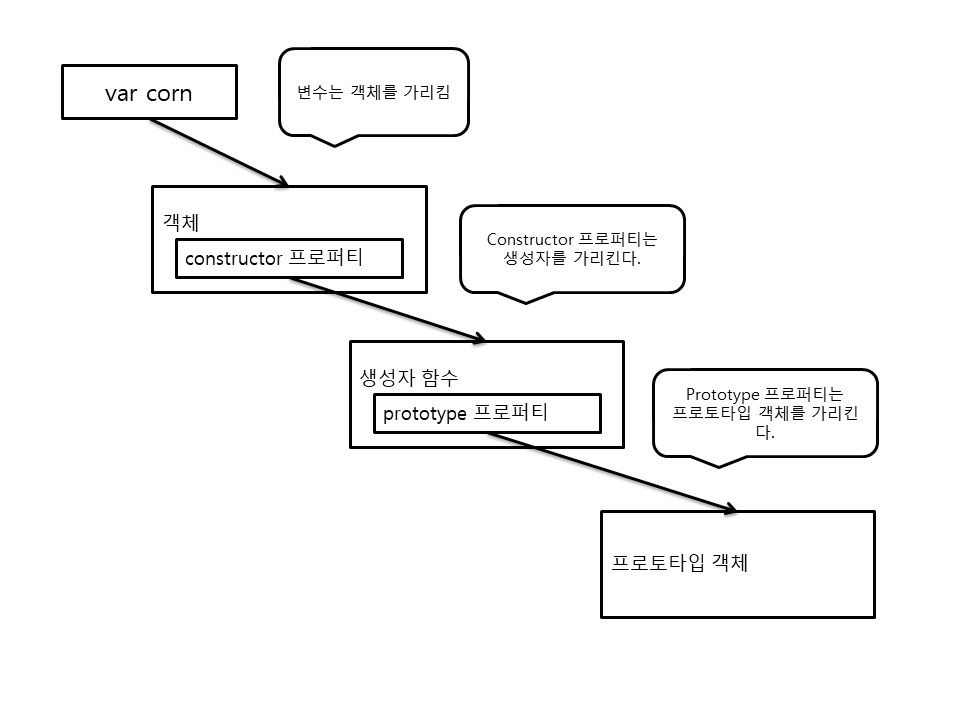

### 객체 지향과 프로토타입

프로토타입은 객체의 타입을 정의하는데 편한게 사용하는 수단이지만 실제로는 함수의 기능이다.

자바스크립트에서 프로토타입은 **객체의 프로퍼티를 정의하고, 객체의 인스턴스에 자동으로 적용되는 기능을 정의하는 편리한 수단**이다. (청사진 역할, java 클래스와 비슷한 역할을 함)


### 6.1 인스턴스 생성과 프로토타입

모든 함수에는 prototype 프로퍼티가 존재(생성자로 사용하지 않으면 필요 없음)

**6.1.1 객체 인스턴스 생성**

**객체 청사진으로서의 프로토타입**

```javascript
function Corn(){};
Corn.prototype.swingSword = function(){
    return true;
};

var corn1 = Corn();
console.log(corn1 === undefined);
var corn2 = new Corn();
console.log(corn2 && corn2.swingSword && corn2.swingSword()); // 인스턴스가 존재하고 메서드도 호출 가능
```

new 연산자를 사용하면 **새로운 객체가 생성**되고(corn2) 이 객체가 **함수의 컨텍스트로 설정**된다. new 연산자의 반환 값은 새로운 객체를 참조한다. 또한, **호출 가능한 swingSword() 메서드**를 가지고 있다.


**인스턴스 프로퍼티**

생성자 함수 내에서 this 매개변수를 사용하여 객체를 초기화 할수도 있음.

*초기화 과정에서 일어나는 우선순위 살펴보기*

```javascript
function Corn(){
    this.swung = false;
    this.swingSword = function(){
        return !this.swung;
    }
}

Corn.prototype.swingSword = function(){
    return this.swung;
}

var corn = new Corn();
corn.swingSword(); // true가 반환됨
```

메서드를 생성자 함수내에 추가하고, prototype 프로퍼티에 메서드를 추가하였다.

=> 생성자 내에서 만들어진 인스턴스 멤버가 프로토타입에 정의된 같은 이름의 프로퍼티를 재정의 함


**초기화 수행 순서**

1. 프로토타입의 프로퍼티들이 새로 만들어진 객체 인스턴스와 바인딩된다.
2. 생성자 함수 내에서 정의한 프로퍼티들이 객체 인스턴스에 추가된다.

생성자 내에서 수행하는 바인딩은 항상 프로토타입의 바인딩보다 우선한다.


**프로토타입 프로퍼티가 실행되는 간략한 개요**

1. 객체의 프로퍼티를 참조하면, 그 객체는 자신에게 해당하는 프로퍼티가 존재하는지를 먼저 검사. 만약 해당 프로퍼티가 존재하면 그값을 사용
2. 없으면, 그 객체와 관련된 프로토타입에 해당 프로퍼티가 있는지 검사. 만약 있다면 프로토타입에 잇는 값을 사용 없다면
3. 그 값은 undefiend

=> 프로토타입이 지니고 있는 프로퍼티가 객체가 만들어질 때, 객체에 복사되는 것처럼 보이지만 그저 생성된 객체에 프로토타입이 덧붙을 뿐이다. (아래 예제 참고, 프로토타입 프로퍼티를 더 늦게 만들었지만 실행이 된다.)

```javascript
function Corn(){
    this.swung = true;
}

var corn = new Corn();
Corn.prototype.swingSword = function(){
    return this.swung;
};

corn.swingSword(); // true
```



자바스크립트의 모든 객체는 constructor라는 프로퍼티를 갖고 있으며, 그 프로퍼티는 그 객체를 만드는 데 사용한 생성자를 참조한다. 그리고 프로토타입은 생성자의 프로퍼티이기 때문에 모든 객체는 자신의 프로토타입을 찾을 수 있다.

이러한 실시간 업데이트는  객체 인스턴스가 생성된 후라도 나중에 **객체의 기능을 확장**할 수 있다. 함수형 프레임워크를 구축할 수 있는 것은 이런 실시간 업데이트 덕


**6.1.2 생성자와 객체 타입**

```javascript
function Corn(){}
var corn = new Corn();
console.log(typeof corn == "object");
console.log(corn instanceof Corn); // instanceof를 사용하여 생성자 식별
console.log(corn.constructor == Corn); // constructor를 참조하여 실제 생성자 함수 참조
```

instanceof : 어떤 생성자 함수를 사용하여 인스턴스를 만들었는지를 확인가능

constructor 프로퍼티 : 인스턴스를 생성한 원본 함수를 참조

consturctor 프로퍼티를 이용하여 역으로 원본 생성자를 참조할 수 있다.

```javascript
function Corn(){}
var corn1 = new Corn();
var corn2 = new corn1.constructor();
console.log(corn2 instanceof Corn);
console.log(corn1 !== corn2); // 서로 별개의 인스턴스
```


**6.1.3 상속과 프로토타입 체인**

*프로토타입 체인*

```javascript
function Person(){}
Person.prototype.dance = function(){};

function Ninja(){}
Ninja.prototype = {dance : Person.prototype.dance};

var ninja = new Ninja();
console.log(ninja instanceof Ninja); // ninja는 Ninja의 프로토타입의 기능을 물려받음(true)
console.log(ninja instanceof Person); // Person 프로토타입 기능을 물려받음(false)
console.log(ninja instanceof Object); // Object 프로토타입 기능을 물려받음(true)
```

Person의 프로퍼티를 단지 복사할 뿐, 상속의 개념은 아니다.


**프로토타입 체인을 생성하는 제일 좋은 방법은 상위 객체의 인스턴스를 하위 객체의 프로토타입으로 사용하는 것**

```javascript
SubClass.prototype = new SuperClass();
Ninja.prototype = new Person();
```

SubClass 인스턴스의 프로토타입은 SuperClass의 인스턴스이고, SuperClass의 인스턴스는 SuperClass의 프로토타입을 갖고 있으며, SuperClass의 프로토타입에는 SuperClass의 모든 프로퍼티가 있다.


*프로토타입을 사용하여 상속하기*

```javascript
function Person(){}
Person.prototype.dance = function(){};

function Ninja(){}
Ninja.prototype = new Person();

var ninja = new Ninja();
console.log(ninja instanceof Ninja); // ninja는 Ninja의 프로토타입의 기능을 물려받음(true)
console.log(ninja instanceof Person); // Person 프로토타입 기능을 물려받음(true)
console.log(ninja instanceof Object); // Object 프로토타입 기능을 물려받음(true)
console.log(typeof ninja.dance == "function"); // ninja는 춤을 출 수 있음
```

> Ninja.prototype = Person.prototype 과 같이 Person 프로토타입 객체를 직접 Ninja 프로토타입으로 설정하는 것은 권장되지 않는다.
>
> Ninja프로토타입에 일어나는 모든 변경사항이 Person 프로토타입에도 적용되기 때문에 부작용을 초래할 수 있기 때문이다.


**6.1.4 HTML DOM 프로토타입**

모든 DOM 엘리먼트는 HTMLElement 생성자를  상속한다.

따라서 우리는 HTMLElement에 접근할 수 있으므로, 어떤 HTML노드든 선택에 따라 확장할 수 있다.

```html
<html>
	<body>
		<div id="a">삭제1</div>
		<div id="b">삭제2</div>
	</body>
	<script type="text/javascript">
		HTMLElement.prototype.remove = function(){
			if(this.parentNode){
				this.parentNode.removeChild(this);
			}
		}

		//var a = document.getElementById("a");
		//a.parentNode.removeChild(a);

		document.getElementById("b").remove();

	</script>
</html>
```

HTMLElement 생성자의 프로토타입을 확장하여 새로운 remove() 메서드를 만들 수 있다.

// 하지만 new HTMLElement() 는 불가능하다. 브라우저가 루트 생성자와 프로토타입을 노출하기는 하지만, 실제로 생성자를 호출하는 기능은 작동하지 않는다.


